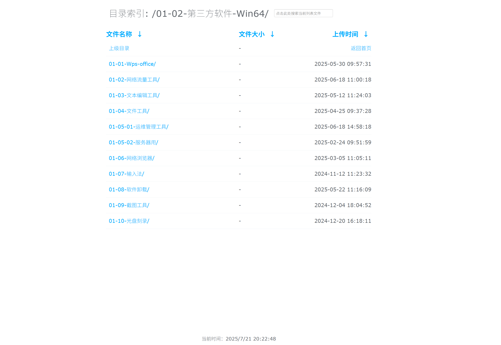

# fancyindex-theme-zh
### fancyindex 其中一个主题的美化。
### fork form https://GitHub.com/Naereen/Nginx-Fancyindex-Theme

## 仅保证此主题对我的修改过的fancyindex可用。

### 使用方法：
- **在NGINX配置文件的location块里 增加**

```
fancyindex on;
include path/to/fancyindex.conf;
root /path/files/;
```

- **将light-theme-c文件夹放到网站根目录（/path/files/）**


 ### 样式

